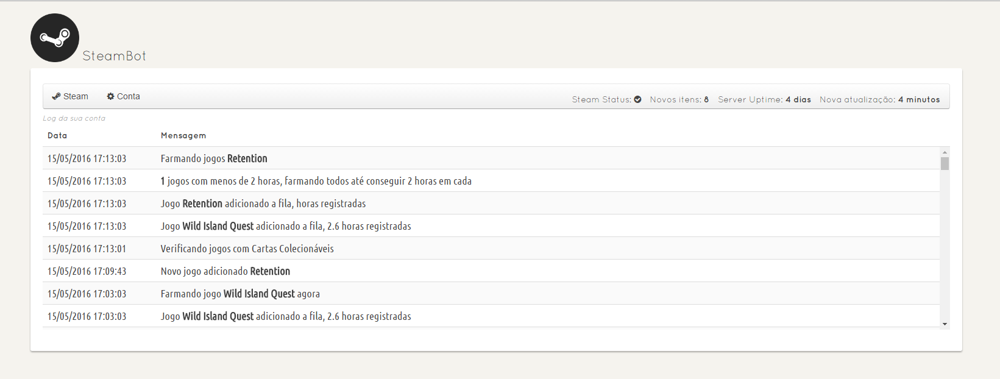
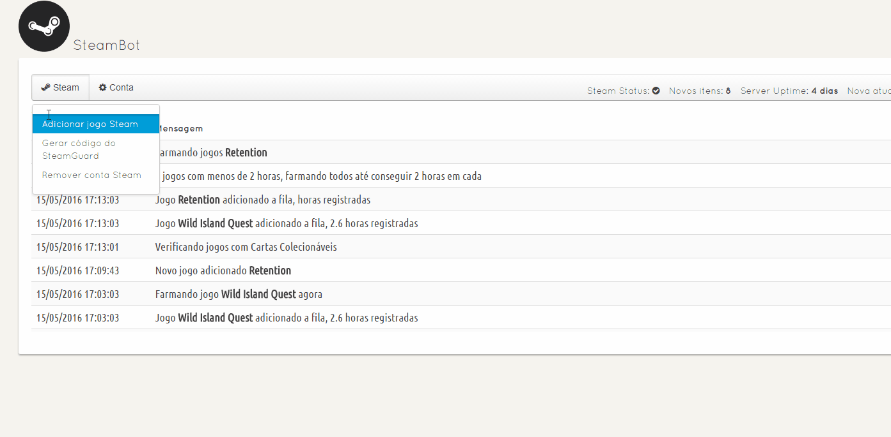

### SteamBot
-----

Bot để farm steam card từ `Nodejs` .

`MÌNH KHÔNG PHẢI CHỦ SOURE CODE NÀY, MÌNH CHỈ VIỆT HOÁ VÀ FIX LỖI THÔI, NHƯNG CÓ BÊ ĐI ĐÂU THÌ GHI NGUỒN LÀ TỪ MÌNH, CÁM ƠN ` cho mình xin 1 starts nha :3

## Preview

## How to use

Những thứ cần Thiết để vận hành bot:
`Nodejs` Bắt buộc phải có để vận hành bot
`XAMPP` dùng để kết nối tới bot, nếu có host xịn thì quăng lên đấy cũngớc

Trước hết cần phải tải hết tất cả từ package, sử dụng lệnh:
`npm install`

Để khởi động bot sử dụng lệnh (run lần đầu để chắc chắn không xảy ra lỗi và tắt đi):

`node app.js`

Sau đó config lại file `config.json` trong đấy có tất tần tật về mọi thứ nhưng bạn chỉ cần chỉnh phần `port` thôi, không chỉnh cũng được. Nếu bot đang chạy thì hãy tắt đi hẳn chỉnh nha.

Sau bước trên bot bạn đã hoạt động rồi đấy, bây giờ bạn cần config lại ip socket thôi. Nếu như bạn để mặc định thì bạn không cần chỉnh gì cả, nếu bạn đã chỉnh phần `port` ở phía trên thì bạn phải vào phần website/js/global.js tìm tới mục `function socket_connect` để chỉnh.

Đến đây chắc server bạn chạy tốt rồi Đúng không :D Thế bắt đầu đăng nhập acc vào và treo thôi!

`MÌNH KHÔNG PHẢI CHỦ SOURE CODE NÀY, MÌNH CHỈ VIỆT HOÁ VÀ FIX LỖI THÔI, NHƯNG CÓ BÊ ĐI ĐÂU THÌ GHI NGUỒN LÀ TỪ MÌNH, CÁM ƠN` cho mình xin 1 starts nha :3

